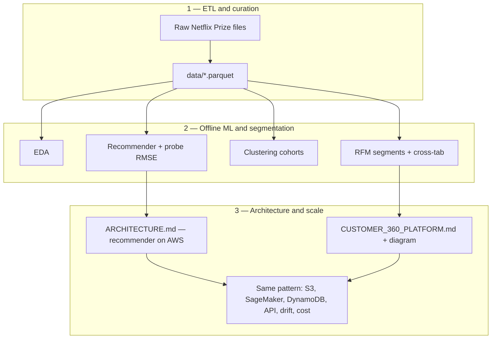

# ML Systems Portfolio — From ETL to Architecture (One Repo)

> **One continuous story:** ingest and curate behavioural data (ETL), build
> **recommendations** and **segmentation** (RFM + clustering) on a public
> corpus, then **connect those artefacts to AWS architectures** — first for
> a Netflix-style recommender at scale, then for an enterprise **Customer 360**
> platform. Same production muscles (medallion storage, SageMaker, DynamoDB,
> API + SLOs, model card, MLOps, cost model); the dataset is the teaching lab,
> the Customer 360 doc is the same pattern at enterprise breadth.


---

## Contents

1. [The single pipeline (at a glance)](#the-single-pipeline-at-a-glance)
2. [Why one repo, not two](#why-one-repo-not-two)
3. [Repository layout](#repository-layout)
4. [How ETL connects to RFM and architecture](#how-etl-connects-to-rfm-and-architecture)
5. [Headline results](#headline-results)
6. [Quickstart](#quickstart)
7. [Documents](#documents)
8. [What I'd do next](#what-id-do-next)
9. [Honest limits](#honest-limits)
10. [Credits and license](#credits-and-license)

---

## The single pipeline (at a glance)



| Phase | What you run / read | Outcome |
|--------|----------------------|---------|
| **1 — ETL** | `python run_data_loading.py` | `data/ratings.parquet`, `data/probe.parquet` — single source for all downstream steps |
| **2 — Analytics** | `run_eda.py` → `run_recommendation.py` → `clustering.py` → `run_rfm.py` (or notebooks `01`–`05`) | Recommender quality, behavioural clusters, RFM segments tied together |
| **3 — Architecture** | [`docs/ETL_TO_ARCHITECTURE.md`](docs/ETL_TO_ARCHITECTURE.md), [`ARCHITECTURE.md`](ARCHITECTURE.md), [`docs/CUSTOMER_360_PLATFORM.md`](docs/CUSTOMER_360_PLATFORM.md), notebook `06` | How the offline path maps to serving, governance, and multi-source Customer 360 |

---

## Why one repo, not two

Splitting “Netflix code” and “Customer 360 deck” into separate folders made
it *feel* like two submissions. In practice:

- **RFM and clustering** are the same *kind* of artefact a Customer 360
  consumption zone would serve to Connect, Pinpoint, or QuickSight.
- **ETL to Parquet** is the same *shape* as landing curated tables in a
  medallion lake before feature pipelines.
- **[`ARCHITECTURE.md`](ARCHITECTURE.md)** (recommender) and
  **[`docs/CUSTOMER_360_PLATFORM.md`](docs/CUSTOMER_360_PLATFORM.md)** are two
  **zoom levels** on how to run ML on AWS, not two unrelated projects.

So this repo is **one portfolio**: lab execution + production design + enterprise scale-up narrative.

---

## Repository layout

```
.
├── README.md                    <- you are here
├── LICENSE
├── requirements.txt
├── ARCHITECTURE.md              <- AWS design for the recommender path + cost
├── MODEL_CARD.md                <- Mitchell template (recommender)
├── README_academic.md           <- original course framing
│
├── src/netflix_recommender/     <- importable Python (ETL, EDA, recommend, cluster, RFM)
├── run_data_loading.py          <- CLI entry points (same code as notebooks)
├── run_eda.py
├── run_recommendation.py
├── clustering.py
├── run_rfm.py
│
├── notebooks/                   <- thin wrappers 01–05 + architecture bridge 06
├── outputs/                     <- figures (+ small CSV where noted)
├── architecture/              <- Customer360_Architecture.drawio (+ export PNG when ready)
│
└── docs/
    ├── ETL_TO_ARCHITECTURE.md   <- explicit map: ETL → RFM → enterprise design
    ├── NETFLIX_PIPELINE.md      <- deep dive on modelling + CLI (former project README)
    ├── CUSTOMER_360_PLATFORM.md
    ├── RESUME_BULLETS.md
    ├── API.md
    ├── MLOPS.md
    └── assignment/              <- course briefs
```

---

## How ETL connects to RFM and architecture

Read **[`docs/ETL_TO_ARCHITECTURE.md`](docs/ETL_TO_ARCHITECTURE.md)** — it is
the short “glue” document that walks from Parquet outputs to segmentation
artefacts to the Customer 360 swim-lanes and [`architecture/Customer360_Architecture.drawio`](architecture/Customer360_Architecture.drawio).

---

## Headline results

| Track | Headline |
|--------|-----------|
| **Recommender** | **Probe RMSE 0.9491** — SVD + item–item residual correction (see `run_recommendation.py` / notebook `03`) |
| **Segmentation** | RFM nine-segment scheme + cross-tab vs K-Means clusters (notebook `05`, `run_rfm.py`) |
| **Recommender @ AWS** | Sized stack ~**$9.3K/mo @ 1M MAU**, 150 ms p95 — [`ARCHITECTURE.md`](ARCHITECTURE.md) |
| **Customer 360 @ AWS** | 7 swim lanes, **~$12.5K/mo**, &lt;150 ms p95 scoring — [`docs/CUSTOMER_360_PLATFORM.md`](docs/CUSTOMER_360_PLATFORM.md) |

---

## Quickstart

```bash
git clone <your-repo-url> && cd <repo-dir>
python -m venv .venv && source .venv/bin/activate   # Windows: .venv\Scripts\activate
pip install -r requirements.txt

# 1) Obtain Netflix Prize data from Kaggle; place under ./dataset/
#    https://www.kaggle.com/datasets/netflix-inc/netflix-prize-data

python run_data_loading.py              # ETL → data/*.parquet
python run_eda.py
python run_recommendation.py            # long run; add --skip-hybrid for dev
python clustering.py
python run_rfm.py
```

Optional: `jupyter lab notebooks/` and run `01`–`06` in order. Notebook **06**
is mostly narrative + links (architecture bridge).

---

## Documents

| Document | Role |
|----------|------|
| [`docs/ETL_TO_ARCHITECTURE.md`](docs/ETL_TO_ARCHITECTURE.md) | Connects ETL, RFM/clustering, and enterprise architecture |
| [`docs/NETFLIX_PIPELINE.md`](docs/NETFLIX_PIPELINE.md) | Full modelling + CLI narrative |
| [`docs/CUSTOMER_360_PLATFORM.md`](docs/CUSTOMER_360_PLATFORM.md) | Customer 360 platform (architecture-first) |
| [`ARCHITECTURE.md`](ARCHITECTURE.md) | Recommender AWS reference + cost |
| [`MODEL_CARD.md`](MODEL_CARD.md) | Model card |
| [`docs/API.md`](docs/API.md), [`docs/MLOPS.md`](docs/MLOPS.md) | API contract + MLOps (recommender path) |
| [`docs/RESUME_BULLETS.md`](docs/RESUME_BULLETS.md) | Resume-ready bullets |

*Planned Customer 360 sub-docs* (API/MLOps/SECURITY/model card at C360 specificity) can be added under `docs/` later as separate files; the platform overview already states what is live vs planned.

---

## What I'd do next

1. Ship the recommender MLOps path to a real SageMaker dev pipeline + API Gateway stage (spec exists in `docs/`).
2. Add a **public churn benchmark** so Customer 360 has measured metrics, not only architecture.
3. Export **`architecture/Customer360_Architecture.png`** from the `.drawio` so the platform doc renders on GitHub without opening diagrams.net.
4. Optional fairness / slice evaluation on the recommender and on any future churn model.

---

## Honest limits

- **Not deployed** — designs and offline ML are real; no production traffic.
- **Customer 360 churn model** is architecture-first; classifier is planned where stated in the platform doc.
- **Netflix Prize** is used as a **lab dataset**; rights and terms belong to Netflix, not this MIT-licensed code.

---

## Credits and license

Course lineage and team credits for the **original** group modelling work
live in **[`README_academic.md`](README_academic.md)** and
**[`docs/NETFLIX_PIPELINE.md`](docs/NETFLIX_PIPELINE.md)**. The **Customer 360**
narrative builds on Cloud Engineering / MLDS reference architectures; see
**[`docs/CUSTOMER_360_PLATFORM.md`](docs/CUSTOMER_360_PLATFORM.md)** for scope
and references.

**License:** [MIT](LICENSE). Netflix Prize **data** is not included and remains
subject to Kaggle / Netflix terms.

---

*Yuanyuan Xie · MLDS @ Northwestern · 2026*
