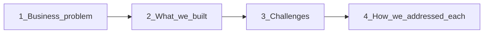

# Netflix Recommendation System at Scale
## End-to-End ML & AWS Architecture
=======
# Behavioural Intelligence at Scale — Recommendations, Segments & Churn-Ready ML Ops


**Netflix Prize corpus · hybrid recommender · user & movie clustering · RFM · reproducible churn proxy pipeline**

<p align="center">
  <b>Yuanyuan Xie</b><br/>
  <a href="mailto:yyuanxie1101@gmail.com">yyuanxie1101@gmail.com</a>
</p>

<p align="center">
  
  
  
  
  
  
</p>

---

## Narrative spine (how to read this page)



1. **Problem** — Subscribers only stay if the catalogue feels personal; irrelevant recommendations and drifting engagement read as churn risk.  
2. **Solution** — An **offline behavioural stack**: ETL → EDA → hybrid ratings model → behavioural clusters → RFM cohorts → **plus** a **YAML-driven churn proxy pipeline** (`pipeline.py`) with Docker/S3 hooks that mirrors how coursework and production workflows package the same intent.  
3. **Challenges** — Extreme sparsity, 100M+ events, interpreting cluster quality vs business coverage, and turning notebooks into reproducible artefacts.  
4. **Mitigations** — Principled hybrids (SVD + residual KNN), constrained neighbours, PCA-backed clustering with an explicit segmentability trade-off, dual CLIs/modular packages, and config-first automation.

Everything below walks that arc with **figures first** wherever possible — the screenshots are part of the story, not decoration.

---

## 1 · The problem: relevance, differentiation, and silent churn

<p align="center">
  
</p>

Recommendation quality is inseparable from **retention and revenue**: when the next title feels random, subscribers disengage — the same behavioural fade that motivates **churn modelling** downstream. This repository uses the public **Netflix Prize** corpus (1998–2005 ratings) not to claim a live Netflix deployment, but to **stress-test** analytics and pipelines at real scale: sparse matrices, uneven activity, catalogue long tails, and the need for **interpretable cohorts** (who is fragile vs loyal).

<p align="center">
  
</p>

| Slice | Orders of magnitude |
|-------|---------------------|
| Total ratings | **100,480,507** |
| Users / titles | **480,189** users · **17,770** movies |
| Sparsity | ~**98.8%** (collaborative filtering regime) |
| Raw → analytics | Tab-delimited files → **`data/*.parquet`** with calendar features from [`data_io`](src/netflix_recommender/data_io.py) |

<p align="center">
  
</p>

<p align="center">
  
</p>

These charts anchor the empirical story before any model equations: heavy tails dictate **factorization-first** modelling; popularity concentrates **where neighbourhoods are trustworthy**; positivity bias motivates **explicit bias layers** rather than naive means.

---

## 2 · The solution: two complementary footprints in one repo

| Track | Purpose | Primary entrypoints |
|-------|---------|---------------------|
| **Research & segmentation** (`netflix_recommender`) | End-to-end *analysis*: ETL → EDA → hybrid recommender → clustering → RFM dashboards | `python -m netflix_recommender …` · [`offline_pipeline.ipynb`](offline_pipeline.ipynb) |
| **Operational churn proxy** (`churn_pipeline`) | *Reproducible* pipeline: ingestion → preprocessing → leakage-aware labels → sklearn classifier → metrics/ROC → optional S3, Docker/ECS shaped | [`pipeline.py`](pipeline.py) · [`config/churn_pipeline.yaml`](config/churn_pipeline.yaml) |

```
Raw Netflix Prize files (local ./dataset/, not committed)
  │
  ▼
ETL ──► Parquet ──► EDA (long tail, bias)
  │
  ├─► Hybrid recommender (SVD + top-movie residual KNN) ──► probe RMSE 0.9491
  │
  ├─► User + movie clustering (PCA + K-Means + comparisons)
  │
  └─► RFM + heatmaps ──► “who to win back?” narrative
Parallel path (config-driven, no Surprise dependency in default run):
  pipeline.py ──► artifacts/*/ (model, metrics, ROC, config snapshot) ──► optional boto3 ──► S3
Production *mapping*: AWS medallion lake, SageMaker, Feature Store — see §4.5 diagram.
```

The **architecture diagram** in §4.5 ties these offline artefacts to representative AWS components; the code here **implements** Python CLIs/modular pipelines and **documents** lift-and-shift to Glue, SageMaker, Step Functions, and activation channels.

---

## 3 · Challenges (where naive approaches break)

| Challenge | What breaks if ignored | Tie-in figures / artefacts |
|-----------|-------------------------|----------------------------|
| **Ultra-sparse feedback** | Global-neighbour collaborative filters collapse; noisy tails dominate | Presentation 04 · hybrid design in §4.2 |
| **Scale & iteration cost** | Full-grid search on 100M rows is infeasible | Tuned SVD on a controlled subsample (`--tune-sample-n`) before full trains |
| **Popularity imbalance** | Residual corrections from rare items hallucinate patterns | Restrict residual KNN to **top-volume movies** · presentation 05 |
| **Clusters vs CRM reality** | High silhouette ≠ assignable cohorts | DBSCAN purity vs mandatory assignment — §4.3 table |
| **Notebook-only workflows** | Non-reproducible grades and fragile handoffs | `pipeline.py`, YAML config, Dockerfile, ECS example JSON |

---

## 4 · How each challenge was addressed (deep dive)

### 4.1 · Data readiness and exploratory discipline

Treat EDA outputs as contractual: long-tail histograms motivate matrix factorization, calendar growth motivates **RFM recency** as a behavioural clock, joint popularity–quality plots justify **bias-aware hybrids**. Code: [`eda.py`](src/netflix_recommender/eda.py).

### 4.2 · Hybrid recommender: global structure plus local residuals

<p align="center">
  
</p>

| Stage | Probe RMSE | Role |
|-------|-----------|------|
| Global mean | 1.1296 | Baseline pessimism |
| User + movie biases | 0.9965 | Per-entity offsets |
| SVD | 0.9632 | Shared low-dimensional taste |
| **SVD + item–item residual KNN** | **0.9491** | Stable global fit + cosine correction where data is dense |

```
ŷ = clip(ŷ_SVD + α · r_KNN, 1, 5),   α = 0.3
```

Residual KNN is intentionally **narrow**: top volume movies × fixed neighbour count reduces variance on the sparse tail — the response to §3’s imbalance challenge. Implementation: [`recommendation.py`](src/netflix_recommender/recommendation.py) · CLI `python -m netflix_recommender recommendation`.

### 4.3 · Behavioural personas: clustering with a production caveat

<p align="center">
  
</p>

<p align="center">
  
</p>

<p align="center">
  
</p>

<p align="center">
  
</p>

| Algorithm | Silhouette (users) | Why we still pick K-Means for CRM overlays |
|-----------|---------------------|--------------------------------------------|
| DBSCAN | **0.6357** | Leaves many users as noise — unacceptable when every subscriber needs a playbook |
| K-Means (k≈4–10 sweep) | 0.28–0.xx | **Hard assignment everywhere** beats purity when Pinpoint-like journeys need completeness |
| Hierarchical Ward | Lower | Computational + interpretability trade-offs |

Scores: [`outputs/04_clustering/algorithm_comparison.csv`](outputs/04_clustering/algorithm_comparison.csv) · Implementation: [`clustering_job.py`](src/netflix_recommender/clustering_job.py).

### 4.4 · RFM: translate ML geometry into stakeholder language

<p align="center">
  
</p>

<p align="center">
  
</p>

<p align="center">
  
</p>

| Dimension | Meaning on this dataset |
|-----------|--------------------------|
| R | Days since last rating (reference **2005-12-31**) |
| F | Rating counts |
| M | Mean rating (**proxy**, not dollar spend — explicit in deck) |

The heatmap resolves the “so what?”: **Lost / Need Attention** overwhelmingly align with Casual Users — aligning **churn narratives** with **coverage-first clustering**. Implementation: [`rfm.py`](src/netflix_recommender/rfm.py).

### 4.5 · Churn-ready path: reproducible pipeline + cloud-shaped outputs

Operational courses and employers ask for artefacts, not anecdotes. **`pipeline.py`** runs end-to-end from [`config/churn_pipeline.yaml`](config/churn_pipeline.yaml): features use ratings **before** \(T_{\text{end}} - \text{horizon}\); labels flag **silent periods** afterwards — leakage-aware churn proxy aligned with coursework rubrics.

| Artifact per run (`artifacts/<run_id>/`) | Role |
|---|---|
| `processed_dataset.parquet` | Tables for grading / audit |
| `model.joblib` / `metrics.json` / `roc_curve.png` | Model + ROC evidence |
| `config_resolved.yaml` | Exactly what shipped |
| S3 uploads (optional `boto3`) | ECS/Fargate + task-role pattern |

Docker: [`Dockerfile`](Dockerfile). Fargate / task definition scaffolding: [`docs/fargate.md`](docs/fargate.md), [`infra/ecs-task-definition.example.json`](infra/ecs-task-definition.example.json).

Quick commands:

```bash
python pipeline.py --config config/churn_pipeline.yaml
docker build -t churn-pipeline . && docker run --rm …   # see runbook §6
```

Tests & lint (`PYTHONPATH=src pytest tests/`, `ruff`, `pylint` with `[tool.pylint]` in [`pyproject.toml`](pyproject.toml)) keep the churn package reviewable independently of the exploratory CLIs.

### 4.6 · Closing the loop: conclusions + AWS blueprint

<p align="center">
  
</p>

<p align="center">
  
</p>

<p align="center"><em>Reference mapping: ingestion → medallion buckets → warehousing/BI → SageMaker-era training & monitoring → Pinpoint / Connect style activation.</em></p>

| Offline module | Repo file | Typical AWS analogue |
|----------------|-----------|-----------------------|
| ETL → Parquet | [`data_io.py`](src/netflix_recommender/data_io.py) | Glue + S3 bronze/silver |
| EDA aggregates | [`eda.py`](src/netflix_recommender/eda.py) | Athena / Studio notebooks |
| Feature-heavy jobs | [`clustering_job.py`](src/netflix_recommender/clustering_job.py) | SageMaker Processing |
| Experimentation-heavy training | [`recommendation.py`](src/netflix_recommender/recommendation.py) | Training jobs / tuning |
| Artefact-heavy pipeline | [`src/churn_pipeline/`](src/churn_pipeline/), [`pipeline.py`](pipeline.py) | Step Functions · ECR/Fargate |
| Multi-command CLI orchestration | [`__main__.py`](src/netflix_recommender/__main__.py) | SageMaker Pipelines / Dagster etc. |

This is an **engineering map**, not a claim that each AWS box is wired in CI from this repo.

---

## · Cross-functional signal (portfolio framing)

| Skill | Evidence |
|-------|----------|
| Data engineering | 100M-row ETL hygiene, parquet contract |
| Statistical thinking | Tail + bias narratives tied to modelling |
| Classical ML depth | Surprise SVD hybrids, PCA clustering, logistic/RF churn |
| Biz translation | RFM + heatmaps for activation |
| MLOps patterns | YAML config, Dockerfile, ECS JSON, boto3 uploads |
| Communication | Narrated slide deck excerpts embedded inline |

---

## · Stack snapshot

| Layer | Choices |
|-------|---------|
| Runtime | Python **3.11** |
| Tables | pandas, NumPy, PyArrow, tqdm |
| Modelling | scikit-learn, SciPy sparse, **scikit-surprise** (recommender path) |
| Viz | Matplotlib, Seaborn, Plotly (RFM 3D, optional HTML) |
| Notebooks | [`offline_pipeline.ipynb`](offline_pipeline.ipynb) |
| Churn automation | **`pipeline.py`**, **PyYAML**, **joblib**, **boto3**, **pytest**, **ruff/pylint** |

Pinned versions: [`requirements.txt`](requirements.txt). Optional lint/test extras: `pip install -e ".[dev]"`.

---

## · Runbook — research stack

```bash
python -m venv .venv && source .venv/bin/activate      # Windows: .venv\Scripts\activate
pip install -r requirements.txt && pip install -e .

# After placing Kaggle Netflix Prize assets under ./dataset/
python -m netflix_recommender data-loading
python -m netflix_recommender eda
python -m netflix_recommender recommendation   # expensive on full corpus
python -m netflix_recommender clustering
python -m netflix_recommender rfm              # --no-plotly-html inside CI/headless
```

Iterate faster:

```bash
python -m netflix_recommender recommendation --skip-nmf --skip-hybrid --tune-sample-n 50000
```

`dataset/` and `data/` stay **gitignored** (licence volume + reproducibility hygiene).

---

## · Runbook — churn proxy automation

<details>
<summary><strong>Expand: env vars, tests, Docker, ECS evidence</strong></summary>

Outputs per run:

| Path | Meaning |
|------|---------|
| `preprocessed_ratings.parquet` | Typed + cleaned ingest |
| `processed_dataset.parquet` | Labels + engineered features |
| `model.joblib` / `test_holdout.npz` | Model bundle + stratified split |
| `metrics.json` / `roc_curve.png` | Evaluation outputs for model quality tracking |
| `config_resolved.yaml` | Exactly what executed |

Configure YAML (split, horizons, model type, buckets). Export **`S3_BUCKET`** (non-empty) to override YAML. Prefer **IAM roles** over long-lived keys. Enable uploads with **`s3.upload_enabled: true`**.

Runtime overrides (optional, no code edits needed):

| Variable | Effect |
|---|---|
| `S3_BUCKET` | Overrides `s3.bucket` |
| `S3_UPLOAD_ENABLED` | Overrides `s3.upload_enabled` (`true/false`, `1/0`) |
| `S3_PREFIX` | Overrides `s3.prefix` |

Quality gates:

```bash
PYTHONPATH=src pytest tests/
ruff check src/churn_pipeline pipeline.py tests
pylint src/churn_pipeline pipeline.py --rcfile=pyproject.toml
```

Docker illustration:

```bash
docker build -t churn-pipeline .
docker run --rm \
  -v "$(pwd)/data:/app/data:ro" \
  -v "$(pwd)/dataset:/app/dataset:ro" \
  -v "$(pwd)/artifacts:/app/artifacts" \
  churn-pipeline

# Run tests inside the same image
docker run --rm churn-pipeline pytest -q tests
```

Operational evidence: CloudWatch logs after Fargate runs should emit `Uploaded: s3://…` lines from [`s3_upload.py`](src/churn_pipeline/s3_upload.py).

</details>

---

## · Production readiness map

| Capability | Where implemented |
|---|---|
| Configuration management | [`config/churn_pipeline.yaml`](config/churn_pipeline.yaml), env overrides in [`config.py`](src/churn_pipeline/config.py) |
| Modular pipeline steps | [`ingestion.py`](src/churn_pipeline/ingestion.py), [`preprocess.py`](src/churn_pipeline/preprocess.py), [`features.py`](src/churn_pipeline/features.py), [`train.py`](src/churn_pipeline/train.py), [`evaluate.py`](src/churn_pipeline/evaluate.py), [`artifacts.py`](src/churn_pipeline/artifacts.py) |
| Single-command orchestration | [`pipeline.py`](pipeline.py) |
| Artifact management | run-scoped outputs under `artifacts/<run_id>/` + config snapshot + metrics + ROC |
| AWS S3 integration | [`s3_upload.py`](src/churn_pipeline/s3_upload.py), bucket/prefix from YAML or env |
| Dockerization | [`Dockerfile`](Dockerfile), default command runs `pipeline.py` |
| Unit testing | [`tests/`](tests): config, preprocess, features, train (9 tests total, happy/unhappy paths) |
| Code quality | `ruff`, `pylint`, logging + explicit exception handling in [`pipeline.py`](pipeline.py) |
| ECS/Fargate | [`infra/ecs-task-definition.example.json`](infra/ecs-task-definition.example.json), run guide in [`docs/fargate.md`](docs/fargate.md) |

<details>
<summary><strong>Hybrid recommender — model card (concise)</strong></summary>

| Field | Detail |
|-------|--------|
| Name | `svd-item-residual-hybrid` |
| Intended use | Netflix Prize-era explicit-feedback benchmark comparisons |
| Headline metric | **Probe RMSE 0.9491** (vs Cinematch ~0.9525 historical reference) |
| Libraries | Surprise SVD · SciPy sparse residuals · cosine KNN overlay |
| Not for | Modern implicit streaming logs, unattended production without refreshed policy/fairness review |

Ground truth splits follow contest semantics implemented in-repo; licences remain with Kaggle/Netflix. See also [Model Cards](https://arxiv.org/abs/1810.03993).

</details>

---

## · Naming the repo (optional, not blocking)

<<<<<<< Updated upstream
This project is built upon [group work](https://github.com/eason034056/netflix-prize-data-mining-project) completed together with Eason Wu, Eric Wu, Kun-Yu Lee, and Xinqi Huang.
=======
Folder **`ml-systems-portfolio`** is a sensible umbrella when you showcase several production-oriented ML systems. Two refinements recruiters like:

| Option | When it helps |
|--------|----------------|
| **`netflix-behavior-intelligence`** (repo rename) | Single flagship story across recommender + RFM + churn proxy |
| **Keep umbrella + subtitle** (`ml-systems-portfolio` README title already reframed) | You plan more non-Netflix repos in the same org |

Rename only if README + CV + GitHub “About” all match — consistency beats cleverness.

---

## · Licence · Acknowledgements

Code is [MIT](LICENSE). Dataset terms remain with Netflix/Kaggle hosts.

Companion analysis grew from collaborative [Netflix Prize mining work](https://github.com/eason034056/netflix-prize-data-mining-project) with Eason Wu, Eric Wu, Kun-Yu Lee, and Xinqi Huang.
