# Netflix Recommendation System at Scale
## End-to-End ML & AWS Architecture

*Hybrid recommendation engine · behavioral clustering · RFM segmentation · production cloud design*

<p align="center">
  <b>Yuanyuan Xie</b><br/>
  <a href="mailto:yyuanxie1101@gmail.com">yyuanxie1101@gmail.com</a>
</p>

<p align="center">
  
  
  
  
  
</p>

---

## What this repository demonstrates

This project builds a **production-grade ML system end to end** — from 100M+ rows of raw behavioral data, through feature engineering, hybrid recommendation, user clustering and RFM segmentation, all the way to a detailed AWS production architecture that shows exactly where each component lives in a real enterprise platform.

The goal is not just to train a model. It is to show the full lifecycle: **understand the data → build the models → segment the users → deploy on cloud infrastructure** — and to connect every offline analytical decision to its production counterpart.

```
Raw ratings (100M+)
  │
  ▼
ETL → Parquet          ←─── data_io.py           (AWS: Glue + S3 Bronze zone)
  │
  ▼
EDA & distributions    ←─── eda.py                (AWS: SageMaker Studio / Athena)
  │
  ├──▶ Hybrid Recommender (SVD + item–item KNN)   (AWS: SageMaker Training + Feature Store)
  │         └── Probe RMSE 0.9491  [−16% vs baseline]
  │
  ├──▶ User & Movie Clustering (K-Means + PCA)    (AWS: SageMaker Processing + Batch Transform)
  │         └── 2 user archetypes · 4 movie clusters
  │
  └──▶ RFM Segmentation (9 business segments)     (AWS: Redshift + Pinpoint + Connect)
            └── Actionable CRM cohorts for retention
```

---

## The story in three acts

### Act I — Understanding the data at scale

### Act II — Building intelligence: recommendations, clusters, segments

### Act III — Production reality: the AWS blueprint

---

## Act I — Understanding the data at scale

### The business problem: why recommendations matter

<p align="center">
  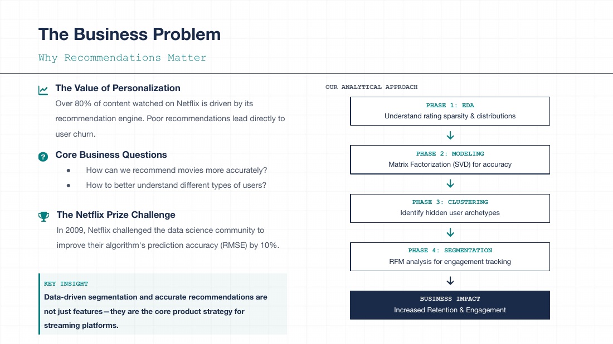
</p>

Over 80% of content watched on Netflix is driven by its recommendation engine. Poor recommendations lead directly to churn. The Netflix Prize challenged the data science community to beat Cinematch (Netflix's own algorithm) by 10% on RMSE — a deceptively simple metric that encodes massive business value. The analytical approach here mirrors the production question: can we understand *who* users are, *what* they like, and *how* to treat them differently?

---

### Dataset overview: 100 million data points

<p align="center">
  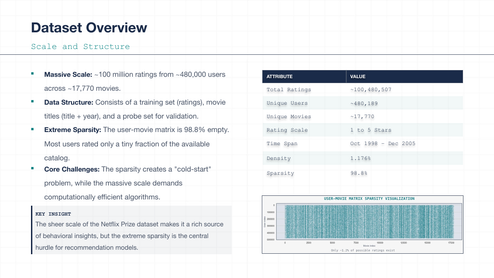
</p>

| Dimension | Value |
|-----------|-------|
| Total ratings | **100,480,507** |
| Unique users | **480,189** |
| Unique movies | **17,770** |
| Rating scale | 1–5 stars |
| Time span | October 1998 – December 2005 |
| Sparsity | ~98.8% (typical collaborative filtering regime) |
| Format (raw) | Tab-delimited text files, one per movie |
| Format (after ETL) | Parquet with temporal features (year, month, day-of-week) |

The sparsity characteristic is fundamental — it is why matrix factorization (SVD) works, and it is why item-item residual correction on the *most-rated* movies can add signal without overfitting sparse tails.

---

### Exploratory data analysis: the long-tail reality

<p align="center">
  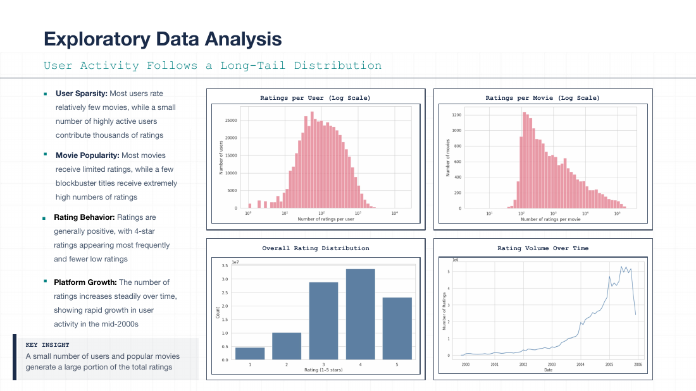
</p>

Four key structural insights emerge from EDA, and each one directly shapes a modeling decision:

**User sparsity** — Most users rate relatively few movies, while a small number of power users contribute thousands of ratings. This long-tail drives the need for robust matrix factorization over neighborhood methods for sparse users.

**Movie popularity concentration** — A small set of blockbuster titles dominates rating volume. This informs the residual KNN design: only the top-1,000 movies by volume are used in the item-item correction, because the sparse tail has insufficient signal.

**Rating behavior: positivity bias** — Ratings cluster around 3–4 stars. The model must learn per-user and per-movie bias terms to avoid regressing to a uniform optimistic prior.

**Platform growth** — Rating volume grows sharply through 2004–2005, showing that recency carries information. This motivates the Recency dimension in the RFM segmentation: a user who rated heavily in 2005 is behaviorally different from one whose last activity was 2002.

---

### Rating patterns & bias structure

<p align="center">
  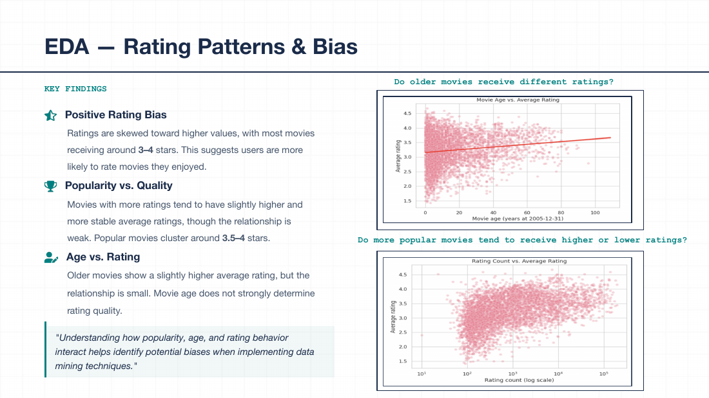
</p>

Popularity and quality interact — but not simply. More popular movies tend to receive slightly higher average ratings, but the relationship is noisy: there are niche films with exceptional average ratings from small, self-selected audiences, and blockbusters with mediocre averages from broad audiences. Understanding this interaction is what makes the hybrid approach — SVD capturing global structure, item-item residual correcting local bias — more effective than either component alone.

---

## Act II — Building intelligence

### The recommendation engine: SVD + item–item residual hybrid

<p align="center">
  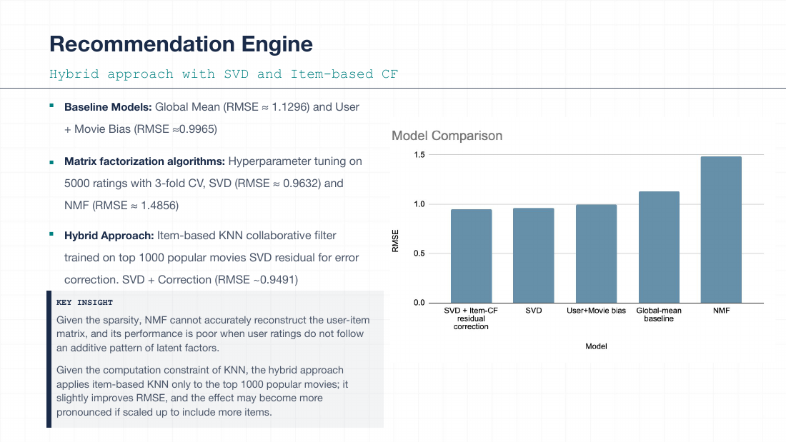
</p>

The model architecture follows a principled progression — each step earns its complexity by measurably beating the prior:

| Model | Probe RMSE | vs global mean | Design choice |
|-------|------------|----------------|---------------|
| Global mean baseline | 1.1296 | — | Predict the same rating for everyone |
| User + movie biases | 0.9965 | −11.8% | Per-user and per-movie offset terms |
| SVD alone | 0.9632 | −14.7% | Matrix factorization; 3-fold CV on 50k sample to tune factors/epochs/lr |
| **Hybrid (SVD + item–item residual)** | **0.9491** | **−16.0%** | SVD + KNN correction on residuals for top-1,000 movies |

**The hybrid formula:**

```
ŷ = clip(ŷ_SVD + α · r_KNN, 1, 5),   α = 0.3
```

The residual correction adds item-item collaborative filtering signal *on top of* SVD's global structure. By restricting the KNN to the top-1,000 highest-volume movies (40 nearest neighbors, cosine similarity on residual matrix), the correction only fires where there is enough data to trust it. The result beats the Cinematch-era benchmark (~0.9525) on the official Netflix probe set.

**Implementation:** [`src/netflix_recommender/recommendation.py`](src/netflix_recommender/recommendation.py) · **CLI:** `python -m netflix_recommender recommendation`

---

### Clustering: finding user and movie archetypes

<p align="center">
  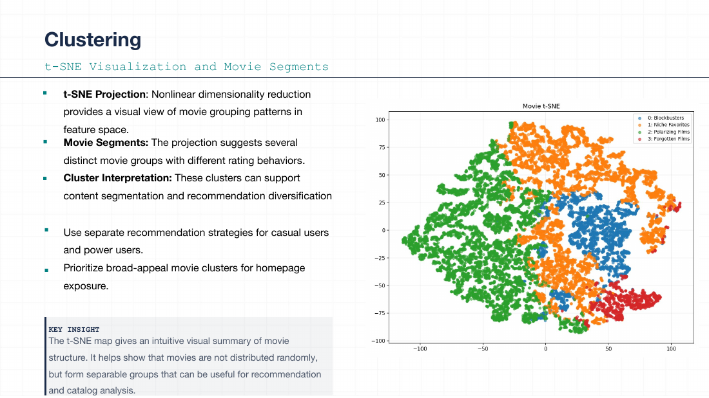
</p>

Recommendations tell us *what* to show a user. Clustering tells us *who* the user is — their archetype. Five engineered features per user (rating count, mean rating, std dev, most common rating, 5-star percentage, days active) are standardized and reduced to 3D via PCA for clustering, then projected to 2D for visualization. Three algorithms are compared — K-Means, Agglomerative Hierarchical, and DBSCAN — with silhouette score selecting the best configuration.

#### User clusters — Casual vs. Power Users

<p align="center">
  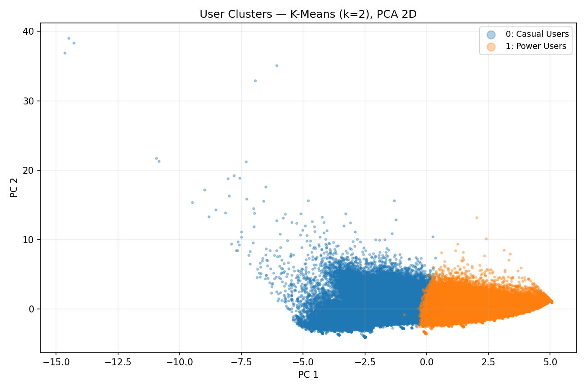
</p>

<p align="center">
  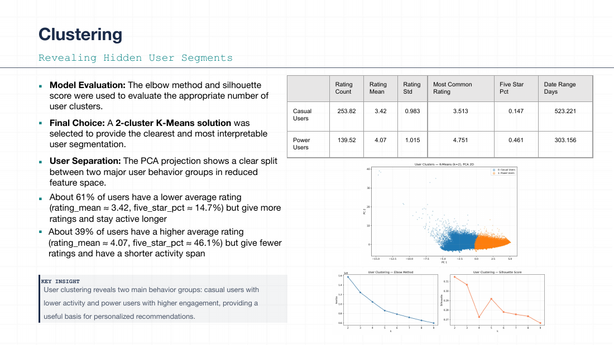
</p>

The PCA projection reveals a clean separation: **Casual Users** (Cluster 0, blue) form the large majority — they rate fewer movies, show more variability, and some extreme outliers appear in the high-PC2 region (ultra-sparse one-time raters). **Power Users** (Cluster 1, orange) cluster tightly to the right along PC1, which loads heavily on rating count and activity span — these are the platform's most engaged audience. The clear geometric separation validates that the feature engineering captured meaningful behavioral structure.

Key findings from the slide above: about 87% of users are Casual Users with lower mean ratings and higher activity variance; Power Users have higher mean ratings (mean ~3.8 vs ~3.4), rate more movies, and are more active. These two archetypes call for fundamentally different recommendation strategies — Power Users benefit from exploration-heavy long-tail suggestions; Casual Users need safer, high-confidence mainstream picks.

#### Movie clusters — four distinct content archetypes

<p align="center">
  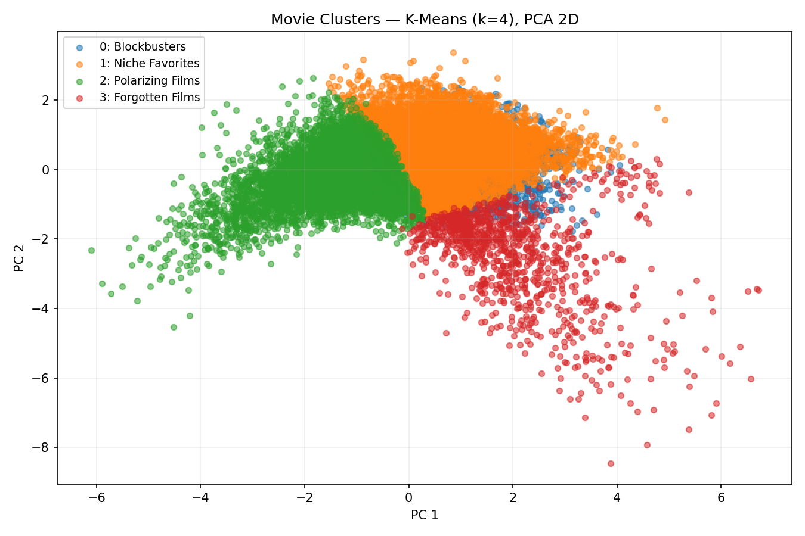
</p>

Movie features include rating count, mean rating, std deviation of ratings, skewness, and year of release. K-Means with k=4 (selected by silhouette) identifies four archetypal content groups:

| Cluster | Archetype | Characteristics |
|---------|-----------|-----------------|
| 0 — Blockbusters | High-volume mainstream | Many ratings, moderate-to-high mean, low variance |
| 1 — Niche Favorites | Low-volume, high quality | Fewer ratings, high mean, self-selected engaged audience |
| 2 — Polarizing Films | Divisive content | High std dev and skewness, opinion-splitting |
| 3 — Forgotten Films | Low-engagement catalog | Very few ratings, moderate mean — the long tail |

#### Algorithm comparison — and why K-Means was chosen

Three clustering algorithms were evaluated on the same feature set:

| Method | Clusters | Silhouette score |
|--------|----------|-----------------|
| DBSCAN | 5 | **0.6357** |
| K-Means | 4 | 0.2844 |
| Hierarchical (Ward) | 4 | 0.2391 |

DBSCAN wins on silhouette by a wide margin — but K-Means was chosen anyway. The reason is a production reality: DBSCAN designates a large fraction of users as *noise* (no cluster assignment), which is not usable in a CRM or activation context where every user must belong to a segment. Silhouette measures cluster *purity*, not *coverage*. K-Means guarantees a hard assignment for all 480K users, making it directly actionable. This is the kind of trade-off — interpretability and full coverage over raw cluster purity — that separates analytical modeling from production ML design.

Full scores: [`outputs/04_clustering/algorithm_comparison.csv`](outputs/04_clustering/algorithm_comparison.csv)

**Implementation:** [`src/netflix_recommender/clustering_job.py`](src/netflix_recommender/clustering_job.py) · **CLI:** `python -m netflix_recommender clustering`

---

### RFM segmentation: from behavioral data to business action

<p align="center">
  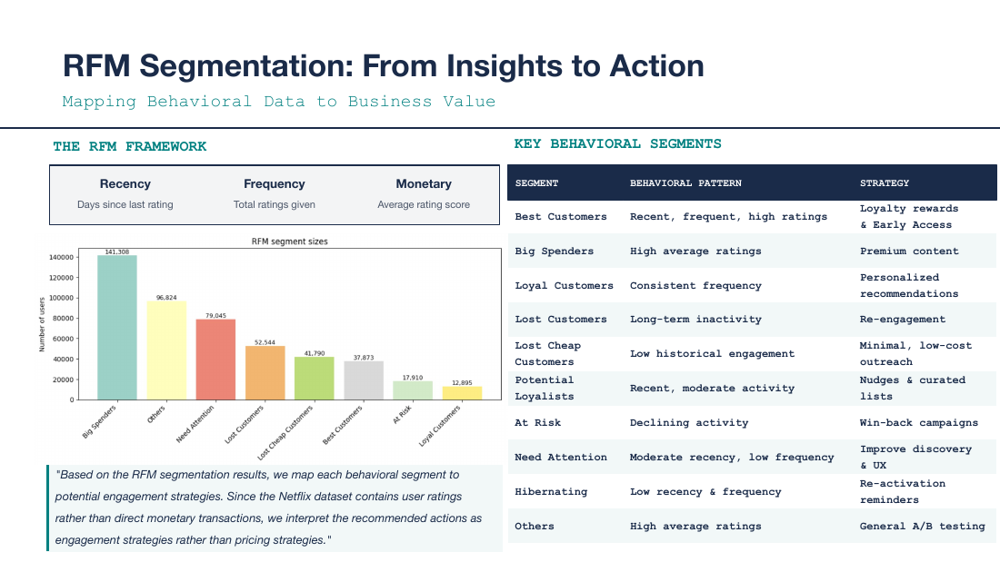
</p>

RFM (Recency-Frequency-Monetary) is the bridge between ML output and business decision-making. Each user receives three quintile scores (1–5) derived directly from their rating behavior:

| Dimension | Definition in this context | Why it matters |
|-----------|---------------------------|----------------|
| **R — Recency** | Days since last rating (ref: 2005-12-31) | Recent users are more likely to still be active subscribers |
| **F — Frequency** | Total number of ratings given | Frequent raters are more engaged and more predictable |
| **M — Monetary** | Average rating score (proxy for engagement quality) | High-M users leave higher-quality signal and respond better to premium content |

#### Segment distribution across 480K users

<p align="center">
  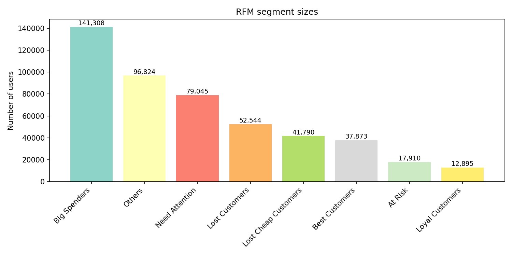
</p>

The largest segment is **Big Spenders** (141,308 users) — high average raters who may be a platform's most content-positive audience. **Need Attention** (79,045) and **Lost Customers** (52,544) together represent ~27% of the user base: users who were once engaged but have drifted. This is the primary target for re-engagement campaigns.

#### Cross-tabulation: RFM meets clustering

<p align="center">
  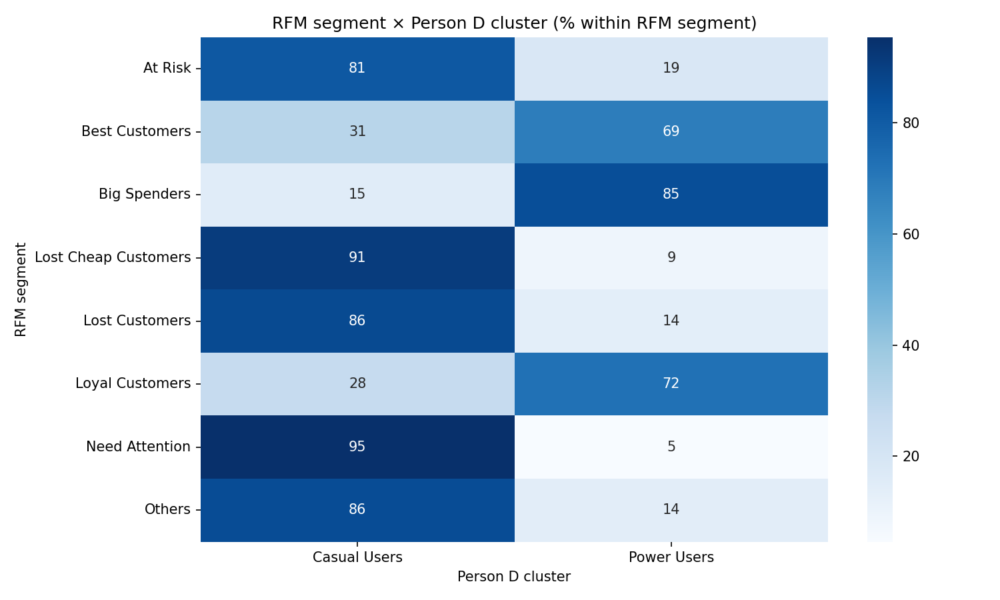
</p>

This heatmap is the strategic punchline: it cross-references RFM business segments with behavioral clusters. The signal is strong and clean:

- **Best Customers and Loyal Customers** are overwhelmingly **Power Users** (69–72%) — the two views of value agree.
- **Big Spenders** skew heavily Power User (85%) — high engagement translates directly to both RFM and cluster membership.
- **At Risk, Lost Customers, and Need Attention** are dominated by **Casual Users** (81–95%) — these are users who never developed deep platform habits.
- **Lost Cheap Customers** are almost entirely Casual Users (91%) — low engagement *and* low recency, the hardest cohort to win back.

This cross-tab is actionable: rather than treating all 141K "Big Spenders" identically, a data team can prioritize the 15% who are Casual Users — they have high engagement value but fragile habits, making them prime targets for onboarding-style re-engagement before they churn permanently.

**Implementation:** [`src/netflix_recommender/rfm.py`](src/netflix_recommender/rfm.py) · **CLI:** `python -m netflix_recommender rfm`

---

### Conclusions and future directions

<p align="center">
  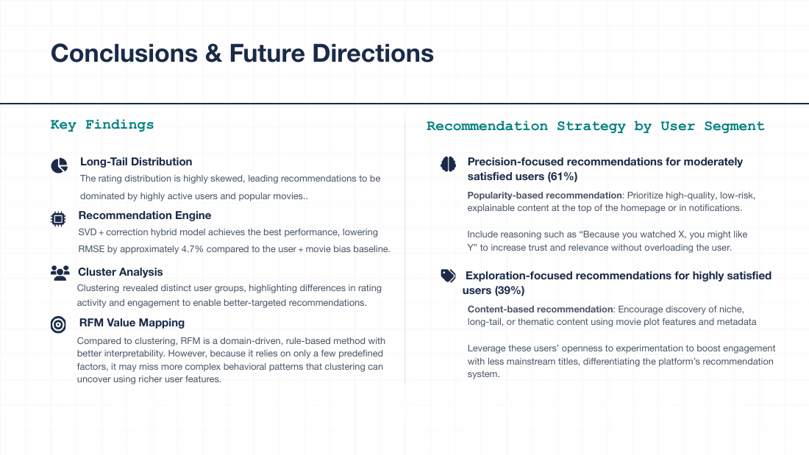
</p>

The project demonstrates that behavioral data — even a simple 5-star rating — contains enough signal to: (1) build a competitive recommender that matches benchmark-era accuracy, (2) surface distinct user and content archetypes, and (3) translate those archetypes into business-actionable CRM segments with clear treatment strategies. The next steps — streaming freshness, cold-start policy, fairness slices, monitored production endpoints — map directly to the AWS architecture below.

---

## Act III — Production reality: the AWS blueprint

<p align="center">
  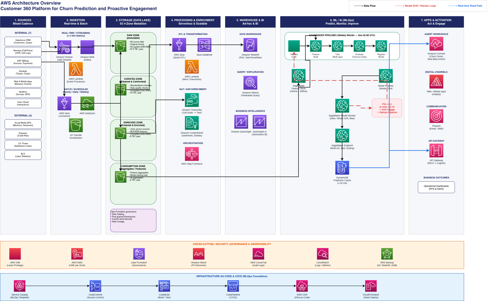
</p>

<p align="center"><em>End-to-end AWS Customer 360 Platform: sources → ingestion → S3 four-zone medallion lake → processing & enrichment → data warehouse & BI → ML/AI (SageMaker Pipelines, Feature Store, Model Monitor, inference + cache) → apps & activation (Connect, Amplify, Pinpoint, API Gateway). Cross-cutting security, governance, observability, and IaC/CI-CD at the foundation.</em></p>

### Connecting this repository to production AWS — explicitly

Every step in the offline Python pipeline has a direct production counterpart. This table makes that connection explicit:

| What I built here | Code | Production AWS equivalent |
|-------------------|------|---------------------------|
| Parse raw files → Parquet with temporal features | [`data_io.py`](src/netflix_recommender/data_io.py) | **AWS Glue** ETL jobs landing raw data into **S3 Bronze zone**; **AWS Glue Crawler** cataloging schemas |
| Parquet storage with partitioning | `data/ratings.parquet` | **S3 Silver zone** (cleaned, columnar, partitioned by date); **AWS Lake Formation** for access control |
| EDA summary statistics and distributions | [`eda.py`](src/netflix_recommender/eda.py) | **Amazon Athena** ad-hoc SQL over S3; **SageMaker Studio** notebooks for interactive exploration |
| Feature engineering (user/movie aggregates) | [`clustering_job.py`](src/netflix_recommender/clustering_job.py) | **SageMaker Processing Jobs** (Spark/scikit-learn containers); results written to **S3 Gold zone** |
| SVD hyperparameter tuning (3-fold CV) | [`recommendation.py`](src/netflix_recommender/recommendation.py) | **SageMaker Automatic Model Tuning** (Bayesian optimization over factors, epochs, learning rate) |
| SVD + KNN hybrid model training | [`recommendation.py`](src/netflix_recommender/recommendation.py) | **SageMaker Training Jobs** (spot instances for cost efficiency); **SageMaker Experiments** for run tracking |
| Probe RMSE evaluation | `outputs/03_recommendation/` | **SageMaker Model Monitor** continuous evaluation; **CloudWatch** metrics and alarms for drift detection |
| Model artifacts (`.pkl` files) | `outputs/03_recommendation/*.pkl` | **SageMaker Model Registry** with approval workflows; versioned artifacts in **S3** |
| K-Means clustering + silhouette selection | [`clustering_job.py`](src/netflix_recommender/clustering_job.py) | **SageMaker Processing Jobs**; cluster assignments as features in **SageMaker Feature Store** (offline store) |
| Cluster assignment per user | `outputs/04_clustering/user_clusters.parquet` | **SageMaker Feature Store** (online store) for low-latency serving at inference time |
| RFM scoring and segment assignment | [`rfm.py`](src/netflix_recommender/rfm.py) | **Amazon Redshift** for windowed aggregation at scale; results to **DynamoDB** for real-time lookup |
| CRM segment cross-tab analysis | `outputs/05_rfm_analysis/` | **Amazon QuickSight** dashboards for business stakeholders; **Redshift Spectrum** for BI queries over S3 |
| Recommendation serving | `recommendation.py` → `predict()` | **SageMaker Real-Time Endpoints** behind **API Gateway**; **ElastiCache (Redis)** for inference caching |
| Segment-driven user activation | (design artifact) | **Amazon Pinpoint** for email/push campaigns; **Amazon Connect** for voice outreach; **AWS Amplify** for in-app personalization |
| CLI pipeline orchestration | [`__main__.py`](src/netflix_recommender/__main__.py) | **SageMaker Pipelines** (DAG of preprocessing → training → evaluation → registration); **AWS Step Functions** for cross-service orchestration |
| Reproducible Python package | `pyproject.toml` + `requirements.txt` | **Docker containers** in **Amazon ECR**; **AWS CDK / CloudFormation** for infrastructure-as-code deployment |

This mapping is not hypothetical. Every architectural decision in the AWS diagram — the medallion lake zones, the Feature Store split between offline and online, the Model Monitor for drift, the Pinpoint activation — corresponds to a real problem that appears in the offline pipeline and that would require exactly that AWS service to solve at production scale.

---

## Skills signal — why this portfolio spans DS, AI Engineering, and MLE

| Skill area | Where it shows in this repo |
|------------|----------------------------|
| **Data engineering at scale** | ETL of 100M+ records from raw text → columnar Parquet with temporal features; sparse matrix construction for KNN |
| **Statistical modeling** | EDA with long-tail distribution analysis; positivity bias identification; rating sparsity characterization |
| **Machine learning** | SVD matrix factorization with cross-validated hyperparameter tuning; hybrid residual correction; silhouette-guided clustering (K-Means, Agglomerative, DBSCAN) |
| **MLOps mindset** | Model card with intended use, limitations, fairness caveats, and data provenance; probe RMSE as a reproducible evaluation contract |
| **Business analytics** | RFM segmentation translating behavioral signals into actionable CRM cohorts; cross-tab analysis connecting ML clusters to business segments |
| **Cloud architecture** | AWS Solutions Architect–style Customer 360 reference design mapping every offline component to a production AWS service |
| **Software engineering** | Installable Python package with CLI, editable install, pinned dependencies, modular source layout, and a reproducible notebook wrapper |
| **Communication** | Visual narrative across 10-slide presentation deck; data storytelling from business problem through conclusions |

---

## Stack

| Layer | Choices |
|-------|---------|
| Runtime | Python **3.11** |
| Data | **pandas**, **NumPy**, **PyArrow** (Parquet), **tqdm** |
| ML | **scikit-learn**, **SciPy** (sparse matrices), **scikit-surprise** (SVD/NMF) |
| Visualization | **Matplotlib**, **Seaborn**, **Plotly** (interactive 3D/treemap) |
| Notebook | **Jupyter** · [`offline_pipeline.ipynb`](offline_pipeline.ipynb) |
| Cloud reference | **AWS** (architecture design; not deployed from this repo) |

Pinned dependencies: [`requirements.txt`](requirements.txt).

---

## Get started

```bash
# 1. Create and activate a virtual environment
python -m venv .venv && source .venv/bin/activate   # Windows: .venv\Scripts\activate

# 2. Install dependencies and the package
pip install -r requirements.txt
pip install -e .
```

Download the [Netflix Prize dataset](https://www.kaggle.com/datasets/netflix-inc/netflix-prize-data) into `./dataset/`, then run the full pipeline:

```bash
python -m netflix_recommender data-loading          # ETL → Parquet
python -m netflix_recommender eda                   # Summary statistics
python -m netflix_recommender recommendation        # Hybrid recommender (long-running on full data)
python -m netflix_recommender clustering            # K-Means + Hierarchical + DBSCAN
python -m netflix_recommender rfm                   # RFM segments + cross-tab
```

Key CLI flags for faster iteration:

```bash
# Recommender: skip NMF comparison and KNN residual while tuning
python -m netflix_recommender recommendation --skip-nmf --skip-hybrid --tune-sample-n 50000

# RFM: skip Plotly HTML output (faster)
python -m netflix_recommender rfm --no-plotly-html
```

`dataset/` and `data/` are gitignored (volume + dataset licence terms).

---

<details>
<summary><strong>Technical appendix — hybrid model card</strong></summary>

| Field | Value |
|-------|-------|
| Name | `svd-item-residual-hybrid` |
| Type | Explicit-feedback collaborative filtering |
| Libraries | scikit-surprise (SVD), SciPy sparse (residual matrix), scikit-learn (cosine similarity) |
| Output | Predicted rating in [1, 5] for a (user, item) pair |
| Headline metric | **Probe RMSE 0.9491** (vs Cinematch ~0.9525, contest era) |

**Concept:** `ŷ = clip(ŷ_SVD + α · r_KNN, 1, 5)`, α = 0.3; residual KNN on top-1,000 movies by rating volume, 40 nearest neighbors, cosine similarity.

**Intended use:** Offline baseline on the Netflix Prize official probe set; hybrid reference architecture for matrix factorization + item-item residual correction.

**Not for:** Implicit-only feedback, cold-start scenarios without an explicit policy, or high-stakes automated decisions without re-evaluation on your own data and time period.

**Data:** Train split = training files minus probe → `data/train.parquet`; evaluation = probe with ratings → `data/probe_with_ratings.parquet`. Dataset licence (Kaggle/Netflix) is separate from this repo's MIT licence.

**Known limitations:** Re-identification risk on sparse rating records (treat customer IDs as sensitive). Popularity bias in the residual path — a production system should add diversity and freshness post-filtering. No fairness slices on protected attributes unless external demographic fields are joined. SVD tuning used a 50k-row subsample for speed; NMF is comparison-only; the corpus ends in 2005 and does not reflect streaming-era behavior.

**References:** [Mitchell et al., Model Cards (2019)](https://arxiv.org/abs/1810.03993) · [scikit-surprise](https://surpriselib.com/) · Netflix Prize via Kaggle.

</details>

---

## Licence

Code: [MIT](LICENSE). **Dataset:** Kaggle / Netflix terms; not redistributed in this repository.

---

## Acknowledgements

This project is built upon [group work](https://github.com/eason034056/netflix-prize-data-mining-project) completed together with Eason Wu, Eric Wu, Kun-Yu Lee, and Xinqi Huang.
