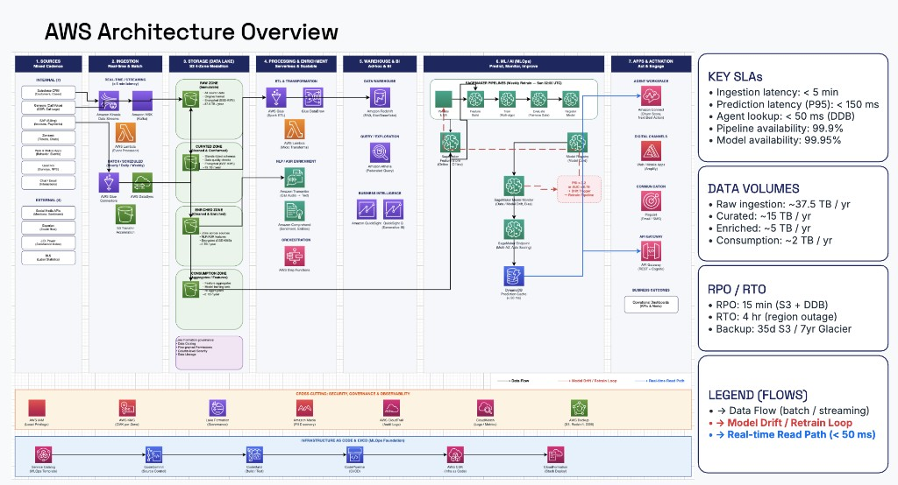

# ML systems portfolio — ETL, segmentation, and AWS reference architecture

This repository does **one** thing: show how **offline** work (parse a public ratings corpus, score a recommender, build RFM + clustering segments) lines up with a **single AWS end-to-end design** — ingestion through activation, with MLOps, security, and CI/CD called out on the diagram.

The **canonical architecture** is the image below (not a second, competing write-up in the README).

---

## Reference architecture



*Seven columns (left to right):* **Sources** → **Ingestion** (streaming + batch) → **S3 medallion lake** (Raw → Curated → Enriched → Consumption) → **Processing & enrichment** (Glue, Lambda, Transcribe, Comprehend, Step Functions) → **Warehouse & BI** (Redshift, Athena, QuickSight) → **ML / AI** (SageMaker Pipelines, Model Monitor, endpoints, DynamoDB cache) → **Apps & activation** (Connect, Amplify, Pinpoint, API Gateway + Cognito). Bottom bands: **security & governance**, **IaC / CI/CD**. Key SLOs and data volumes are on the diagram.

A short text companion (same diagram, column checklist) lives in [`ARCHITECTURE.md`](ARCHITECTURE.md).

---

## What is implemented in code

| Piece | Role |
|--------|------|
| `run_data_loading.py` | ETL: raw Netflix Prize files → `data/ratings.parquet`, `data/probe.parquet` |
| `run_eda.py` | Quick tables on the curated ratings |
| `run_recommendation.py` | Surprise SVD / NMF / hybrid; probe RMSE headline **0.9491** |
| `clustering.py` | User + movie clusters → `outputs/04_clustering/` |
| `run_rfm.py` | RFM scores + segment plots; cross-tab vs clusters |
| `src/netflix_recommender/` | Shared Python modules used by the scripts and notebook |

**Notebook:** [`notebooks/01_offline_pipeline.ipynb`](notebooks/01_offline_pipeline.ipynb) runs the same steps in order (optional: skip the long recommender cell until you need it).

**Model card (recommender only):** [`MODEL_CARD.md`](MODEL_CARD.md).

**Resume bullets (optional):** [`docs/RESUME_BULLETS.md`](docs/RESUME_BULLETS.md).

---

## Quickstart

```bash
git clone https://github.com/yuanyuanxie11/ml-systems-portfolio.git
cd ml-systems-portfolio
python -m venv .venv && source .venv/bin/activate
pip install -r requirements.txt
```

Download the [Netflix Prize](https://www.kaggle.com/datasets/netflix-inc/netflix-prize-data) dataset into `./dataset/` (`training_set/`, `movie_titles.txt`, `probe.txt`). Then:

```bash
python run_data_loading.py
python run_eda.py
python run_recommendation.py    # long; use --skip-hybrid while iterating
python clustering.py
python run_rfm.py
```

`dataset/` and `data/` are gitignored — the repo ships **code + a few figures**, not gigabytes of data.

---

## Outputs kept in git

| Path | Why |
|------|-----|
| `outputs/04_clustering/user_kmeans_pca.png`, `movie_kmeans_pca.png`, `algorithm_comparison.csv` | Clustering sanity check + method comparison |
| `outputs/05_rfm_analysis/rfm_segment_sizes.png`, `rfm_vs_clustering_heatmap.png` | Segmentation story |

---

## License

[MIT](LICENSE). Netflix Prize **data** is not included; use under Kaggle / Netflix terms.

---

*Yuanyuan Xie · 2026*
