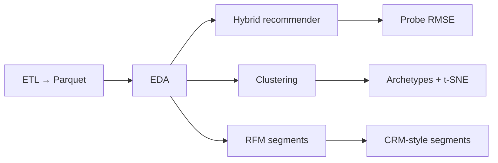
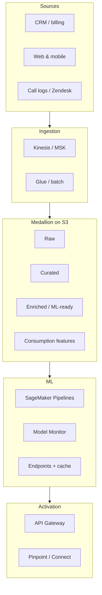

# Netflix Prize — recommendations, clustering & segmentation

**Yuanyuan Xie** — end-to-end **ETL and modelling** on the Netflix Prize dataset (100M+ ratings), **customer segmentation** (clustering + RFM), and a **reference AWS architecture** for how similar workloads run in production (ingest → lake → ML → activation).

Slides below are exported from the course deck (*Netflix Prize Data Mining Project*) for a quick visual walkthrough; metrics match this repository’s offline runs.

---

## Analytical pipeline (this repo)



---

## Presentation gallery

| Cover & problem framing | Dataset & scale |
|:---:|:---:|
|  |  |
|  |  |

| Recommendations | Clustering (movies) |
|:---:|:---:|
|  |  |

| Clustering (users) | RFM framework |
|:---:|:---:|
|  |  |

| Segments → action | Conclusions |
|:---:|:---:|
|  |  |

---

## Tools & stack

### Python & data (this repo)

| Area | Libraries / tools |
|------|-------------------|
| Language | Python **3.11** |
| Data & ETL | **pandas**, **NumPy**, **PyArrow** (Parquet), **tqdm** |
| ML / stats | **scikit-learn**, **SciPy** (sparse), **scikit-surprise** (SVD, NMF, tuning) |
| Visualisation | **Matplotlib**, **Seaborn**, **Plotly** |
| Notebooks | **Jupyter**, **ipykernel** |

Pinned versions: [`requirements.txt`](requirements.txt). Install the package in editable mode so imports and the CLI work from anywhere:

```bash
pip install -r requirements.txt
pip install -e .
```

### AWS (reference design — not deployed)

End-to-end platform (typical services): **Kinesis / MSK**, **Glue**, **S3** (medallion zones), **Lambda**, **Step Functions**, **Transcribe**, **Comprehend**, **Redshift**, **Athena**, **QuickSight**, **SageMaker** (Pipelines, endpoints, Model Monitor), **DynamoDB**, **API Gateway + Cognito**, **Connect**, **Amplify**, **Pinpoint**; cross-cutting **IAM**, **KMS**, **Lake Formation**, observability, **CodePipeline / CDK / CloudFormation**.



**How the offline code maps:** this repository exercises **one slice** of the diagram — land curated tables from a public ratings corpus, engineer features, segment users, and score models. The same pattern extends when many sources, streaming ingest, and activation channels are in scope. Nothing here is deployed to AWS; the diagram is a design reference.

---

## Results (measured offline)

### Recommender — Netflix Prize **probe** set

| Model | Probe RMSE | vs global mean |
|--------|------------|----------------|
| **Hybrid (SVD + item–item residual)** | **0.9491** | **−16.0%** |
| SVD alone | 0.9632 | −14.7% |
| User + movie biases | 0.9965 | −11.8% |
| Global mean baseline | 1.1296 | — |

**Context:** Netflix’s **Cinematch** benchmark was **~0.9525** on the same-era probe; this hybrid sits in that band on commodity hardware with a constrained hyperparameter search. Implementation: `src/netflix_recommender/recommendation.py` and `python -m netflix_recommender recommendation`.

### Data scale (after ETL)

| | Count |
|---|--------|
| Ratings | 100,480,507 |
| Users | 480,189 |
| Titles | 17,770 |

Source: Netflix Prize via Kaggle; not redistributed in this repo.

### Segmentation

- **Clustering:** user and movie **K-Means** on engineered behaviour features; method comparison (silhouette on movies): [`outputs/04_clustering/algorithm_comparison.csv`](outputs/04_clustering/algorithm_comparison.csv) and figures under `outputs/04_clustering/` after you run clustering.
- **RFM-style segments:** nine value / lifecycle segments with **cross-tab vs behavioural clusters** — `python -m netflix_recommender rfm` writes under `outputs/05_rfm_analysis/`.

---

## Model card — hybrid recommender (Netflix Prize probe)

Mitchell et al. (2019) style summary for the **best offline model in this repo**: SVD (**scikit-surprise**) plus an **item–item residual** correction on popular movies.

| Field | Value |
|--------|--------|
| Name | `svd-item-residual-hybrid` |
| Type | Explicit-feedback collaborative filtering |
| Libraries | scikit-surprise, SciPy sparse, scikit-learn cosine similarity |
| Output | Predicted rating in \([1,5]\) for \((user, item)\) |
| Headline metric | **Probe RMSE 0.9491** (vs Cinematch ~0.9525, contest era) |

**Formula (conceptual):** \(\hat{y} = \mathrm{clip}(\hat{y}_{SVD} + \alpha \cdot r_{KNN}, 1, 5)\) with \(\alpha = 0.3\) in the saved implementation; residual neighbourhood on top-1000 movies by volume.

**Intended use:** offline baseline for explicit-feedback ranking on the Netflix Prize probe split; reference hybrid (matrix factorisation + item–item residual).

**Not for:** implicit-only streams, cold-start without a separate policy, credit/health/hiring decisions, or production deployment without evaluation on your own data.

**Data:** train = Netflix Prize training files minus probe → `data/train.parquet`; evaluate = official probe with ratings → `data/probe_with_ratings.parquet`. **Licence:** dataset terms via Kaggle / Netflix; not covered by the repo MIT licence.

**Ethical & safety notes:** re-identification risk on sparse rating data (Narayanan & Shmatikov, 2008) — treat IDs as sensitive. **Popularity bias** — residual path emphasises popular titles; product policy should add diversity / freshness controls. **No fairness slices** on protected attributes (not in data) if you join external attributes in production.

**Limitations:** (1) tuning used a **50k-row subset** for speed; full-grid search would move RMSE slightly. (2) **NMF** in the pipeline is for comparison, not the shipping candidate. (3) **Dataset ends in 2005** — not a model of modern streaming without new features.

**References:** Mitchell et al. (2019), [Model Cards for Model Reporting](https://arxiv.org/abs/1810.03993); [scikit-surprise](https://surpriselib.com/); Netflix Prize rules via Kaggle.

---

## Business impact (what the artefacts enable)

| Outcome area | How the work supports it |
|--------------|---------------------------|
| **Personalisation quality** | **~16% RMSE reduction** vs a naive global baseline → materially better ranking for the same catalogue — fewer irrelevant recommendations, better use of inventory. |
| **Retention & CRM** | **RFM + cluster cross-tab** gives segments for **different plays** (high-value / at-risk / dormant) instead of one-size-fits-all campaigns. |
| **Operations at scale** | The **architecture** section encodes how teams think about **latency, freshness**, drift → retrain, and **governance** before spending on infra. |

---

## How to run

```bash
python -m venv .venv && source .venv/bin/activate   # Windows: .venv\Scripts\activate
pip install -r requirements.txt
pip install -e .
```

If you prefer not to use an editable install, run commands from the repo root with `PYTHONPATH=src` (same subcommands as below).

Place the [Netflix Prize](https://www.kaggle.com/datasets/netflix-inc/netflix-prize-data) files under `./dataset/`, then:

```bash
python -m netflix_recommender data-loading
python -m netflix_recommender eda
python -m netflix_recommender recommendation    # add --skip-hybrid while iterating
python -m netflix_recommender clustering
python -m netflix_recommender rfm
```

Or step through [`offline_pipeline.ipynb`](offline_pipeline.ipynb) from the repo root (same modules as the CLI).

`dataset/` and `data/` are not committed (size + licence).

---

## Licence

Code: [MIT](LICENSE). **Dataset:** Kaggle / Netflix terms; not included here.
