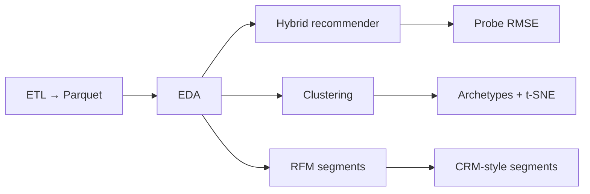
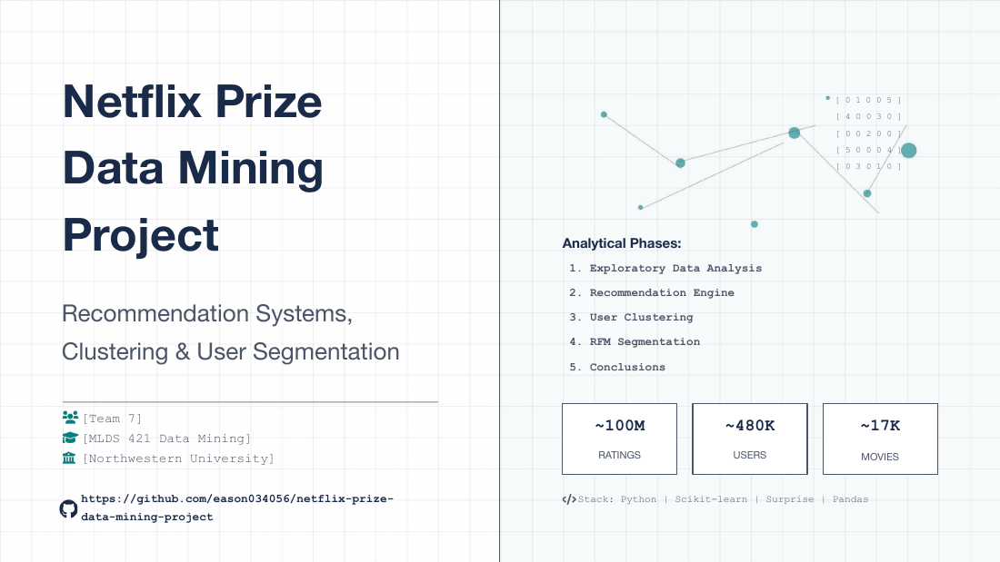

<p align="center">
  <b>Showcase — Netflix Prize at scale</b><br/>
  <sub>Recommendation systems · behavioural clustering · RFM segmentation · production-grade cloud design</sub>
</p>

<p align="center">
  <b>Yuanyuan Xie</b><br/>
  <sub>End-to-end data &amp; ML on 100M+ ratings, paired with an AWS reference architecture for how the same class of workloads runs in production.</sub>
</p>

---

## At a glance

| Pillar | What you will find here |
|--------|-------------------------|
| **Offline ML** | Full ETL to Parquet, hybrid recommender (SVD + item–item residual), user/movie clustering, RFM-style segments — reproducible Python package + one notebook. |
| **Proof points** | Probe **RMSE 0.9491** on the hybrid (vs **~0.9525** Cinematch-era benchmark); **~16%** error reduction vs global mean baseline. |
| **Systems lens** | A detailed **AWS Customer 360** architecture (ingest → medallion lake → ML Ops → activation), shown below as the production counterpart to the lab pipeline. |

---

## Offline analytical journey



The deck below walks through the same narrative (problem → data → EDA → models → clustering → RFM → conclusions). **Numbers in this README match this repository’s measured runs.**

---

## Results — headline metrics

**Recommender (Netflix Prize official probe)**

| Model | Probe RMSE | vs global mean |
|--------|------------|----------------|
| **Hybrid (SVD + item–item residual)** | **0.9491** | **−16.0%** |
| SVD alone | 0.9632 | −14.7% |
| User + movie biases | 0.9965 | −11.8% |
| Global mean baseline | 1.1296 | — |

**Scale after ETL** — 100,480,507 ratings · 480,189 users · 17,770 titles (Kaggle / Netflix terms; raw data not shipped in this repo).

**Segmentation** — K-Means on engineered user/movie features ([`outputs/04_clustering/algorithm_comparison.csv`](outputs/04_clustering/algorithm_comparison.csv)); nine RFM-style segments with cross-tab vs clusters (`python -m netflix_recommender rfm` → `outputs/05_rfm_analysis/`).

Implementation: `src/netflix_recommender/recommendation.py` · CLI: `python -m netflix_recommender recommendation`.

---

## Reference platform — AWS architecture

This diagram is the **AWS Solutions Architect–style** reference for a **Customer 360 platform**: churn prediction, proactive engagement, medallion lake, SageMaker MLOps, and activation through Connect, Amplify, Pinpoint, and API Gateway. It is a **design artefact** (not deployed from this repo); it situates the offline Netflix work in the same architectural language used for enterprise ML platforms.

<p align="center">
  
</p>

<p align="center"><em>Sources → ingestion → S3 four-zone medallion → processing &amp; enrichment → warehouse &amp; BI → ML / AI (pipelines, Feature Store, Model Monitor, inference + cache) → apps &amp; activation. Cross-cutting security, governance, observability, and IaC / CI/CD at the foundation.</em></p>

**Bridge to this repository:** the Python pipeline here is the **curated analytical slice** — land structured ratings, engineer features, segment users, evaluate recommenders offline. Extending to the full diagram means multi-source ingest, streaming freshness, model registry, monitored endpoints, and channel activation — exactly the services called out in the figure.

---

## Story deck — visual walkthrough

| Problem &amp; approach | Data at scale |
|:---:|:---:|
|  |  |
|  |  |
| **Recommendations** | **Clustering — movies** |
|  |  |
| **Clustering — users** | **RFM framework** |
|  |  |
| **Segments → action** | **Conclusions** |
|  |  |

---

## Stack

| Layer | Choices |
|-------|---------|
| Runtime | Python **3.11** |
| Data | **pandas**, **NumPy**, **PyArrow**, **tqdm** |
| ML | **scikit-learn**, **SciPy**, **scikit-surprise** |
| Viz | **Matplotlib**, **Seaborn**, **Plotly** |
| Notebook | **Jupyter** · [`offline_pipeline.ipynb`](offline_pipeline.ipynb) |

Pinned deps: [`requirements.txt`](requirements.txt).

---

## Business narrative

| Outcome | Why it matters |
|---------|----------------|
| **Personalisation** | Stronger probe RMSE → better use of catalogue, fewer irrelevant recommendations at the same inventory depth. |
| **CRM &amp; retention** | RFM plus cluster cross-tab supports differentiated treatment of high-value, at-risk, and dormant cohorts. |
| **Platform thinking** | The AWS view encodes latency, governance, drift → retrain, and activation — the decisions that precede serious infra spend. |

---

## Get started

```bash
python -m venv .venv && source .venv/bin/activate   # Windows: .venv\Scripts\activate
pip install -r requirements.txt
pip install -e .
```

Optional: `PYTHONPATH=src` from repo root if you skip editable install.

Download [Netflix Prize](https://www.kaggle.com/datasets/netflix-inc/netflix-prize-data) into `./dataset/`, then:

```bash
python -m netflix_recommender data-loading
python -m netflix_recommender eda
python -m netflix_recommender recommendation   # e.g. --skip-hybrid while iterating
python -m netflix_recommender clustering
python -m netflix_recommender rfm
```

`dataset/` and `data/` are gitignored (volume + licence).

---

<details>
<summary><strong>Technical appendix — hybrid model card</strong></summary>

| Field | Value |
|--------|--------|
| Name | `svd-item-residual-hybrid` |
| Type | Explicit-feedback collaborative filtering |
| Libraries | scikit-surprise, SciPy sparse, scikit-learn cosine similarity |
| Output | Predicted rating in \([1,5]\) for \((user, item)\) |
| Headline metric | **Probe RMSE 0.9491** (vs Cinematch ~0.9525, contest era) |

**Concept:** \(\hat{y} = \mathrm{clip}(\hat{y}_{SVD} + \alpha \cdot r_{KNN}, 1, 5)\), \(\alpha = 0.3\); residual KNN on top-1000 movies by volume.

**Intended use:** Offline baseline on the official probe; hybrid reference (matrix factorisation + item–item residual).

**Not for:** Implicit-only feeds, cold-start without policy, high-stakes automated decisions without new evaluation on your data.

**Data:** Train = training files minus probe → `data/train.parquet`; eval = probe with ratings → `data/probe_with_ratings.parquet`. Dataset licence is separate from this repo’s MIT licence.

**Notes:** Re-identification risk on sparse ratings (treat IDs as sensitive). Popularity bias in the residual path — add diversity/freshness in product. No fairness slices on protected attributes unless you join external fields. Tuning used a **50k-row** sample for speed; **NMF** is comparison-only; corpus ends **2005**.

**References:** [Mitchell et al., Model Cards (2019)](https://arxiv.org/abs/1810.03993) · [scikit-surprise](https://surpriselib.com/) · Netflix Prize via Kaggle.

</details>

---

## Licence

Code: [MIT](LICENSE). **Dataset:** Kaggle / Netflix terms; not redistributed here.
